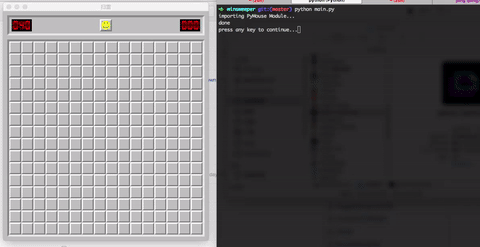

Mac扫雷程序外挂
--

### 算法原理

其实最通用的算法就是,枚举所有的未知的格子得到排列组合,如果一个格子在所有合法的情况下都是雷(或者不是雷),那么可以断定一个格子一定是雷(或者不是雷).

但是这个算法的时间复杂度是 O(2^N), 不过可以进行优化. 比如: 对于不在任何已知格子旁边的未知格子, 因为并没有任何参照可以判定它是否是雷, 所以不必要参加搜索.

总之核心就是减少每次参与搜索的候选格子列表, 我采用的是每次搜索某个已知格子周围的所有未知格子, 得到所有的排列组合.

另外如果遇到无法判断的情况, 则选取概率(局部概率)最小的一个格子点击.

### 截图
采用 pyobjc

### 点击采用
采用pymouse （初始化非常慢）